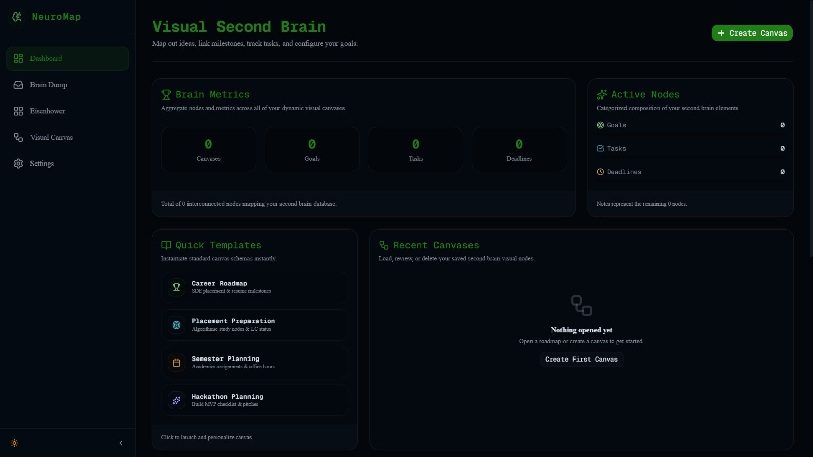
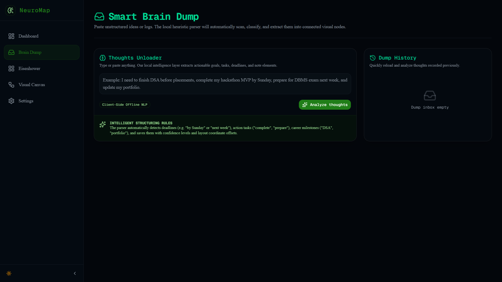
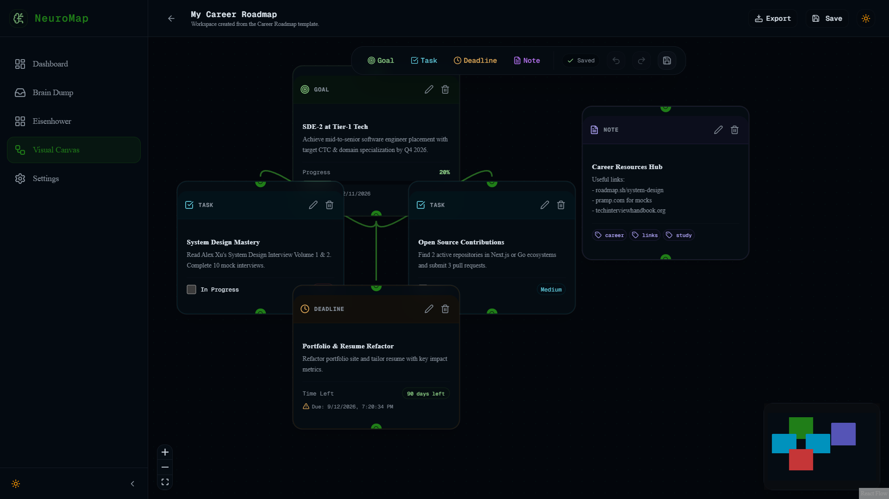
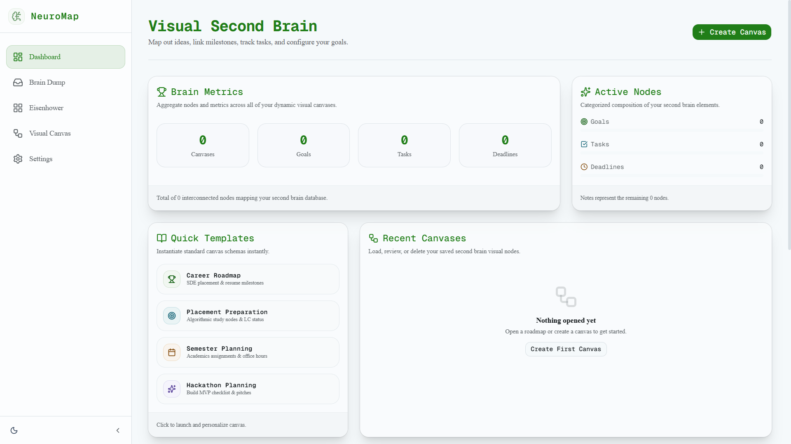

# NeuroMap

### Plan → Connect → Execute

NeuroMap is an AI-powered Visual Second Brain that helps students, developers, and professionals transform unstructured thoughts into actionable visual roadmaps. It combines intelligent planning, visual knowledge mapping, prioritization frameworks, and productivity analytics into a single workspace.

---

## Problem

Students and builders often manage goals, tasks, deadlines, notes, and projects across multiple disconnected tools.

This creates:

* Fragmented planning
* Missed deadlines
* Poor visibility into priorities
* Lack of connections between goals and actions

---

## Solution

NeuroMap provides a visual second-brain system where users can:

* Capture thoughts using Smart Brain Dump
* Convert ideas into structured visual nodes
* Connect goals, tasks, notes, and deadlines
* Detect scheduling conflicts
* Prioritize work using the Eisenhower Matrix
* Track productivity through analytics

---

## Key Features

### 🧠 Smart Brain Dump

Convert unstructured text into:

* Goals
* Tasks
* Deadlines
* Notes

### 🗺️ Visual Canvas

Interactive node-based planning workspace built using React Flow.

### 🔗 Smart Connections

Automatically generate meaningful relationships between goals, tasks, and deadlines.

### 📊 Productivity Analytics

Track:

* Active Goals
* Task Completion
* Upcoming Deadlines
* Productivity Score

### ⚠️ Conflict Detection

Identify:

* Deadline overloads
* Scheduling conflicts
* Productivity bottlenecks

### 🎯 Eisenhower Matrix

Organize work based on urgency and importance.

### ↩️ Undo / Redo

Professional canvas editing with keyboard shortcuts.

### 🎨 Light & Dark Mode

Fully theme-aware experience.

### 💾 Import / Export

Backup and restore NeuroMap workspaces.

---

## Tech Stack

### Frontend

* Next.js 16
* React 19
* TypeScript
* Tailwind CSS
* shadcn/ui
* React Flow

### Backend

* Node.js (Next.js App Router)

### Storage

* Browser Persistence (Local Storage)

### Deployment

* Vercel

---

## Architecture

```text
Brain Dump
    ↓
Parser Engine
    ↓
Node Generation
    ↓
Visual Canvas
    ↓
Conflict Detection
    ↓
Analytics Dashboard
```

---

## Live Demo

https://neuromap-sooty.vercel.app/

---

## Screenshots

### Dashboard



### Smart Brain Dump



### Visual Canvas



### Eisenhower Matrix


### Light Mode



---

## Demo Video

Coming Soon

---

## Getting Started

### Run Locally

```bash
npm install
npm run dev
```

Open:

```text
http://localhost:3000
```

### Live Deployment

NeuroMap is publicly available at:

https://neuromap-sooty.vercel.app/

---

## Future Improvements

* Cloud Synchronization
* Real-Time Collaboration
* AI-Powered Planning Assistant
* Calendar Integrations
* Mobile Application

---

## Hackathon Submission

Built for **Devlynix Buildathon 2.0**

NeuroMap empowers users to transform ideas into connected action plans through visual thinking, intelligent organization, and interactive productivity workflows.

### Tagline

**Plan → Connect → Execute**
